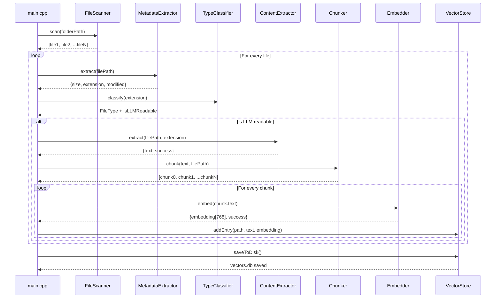
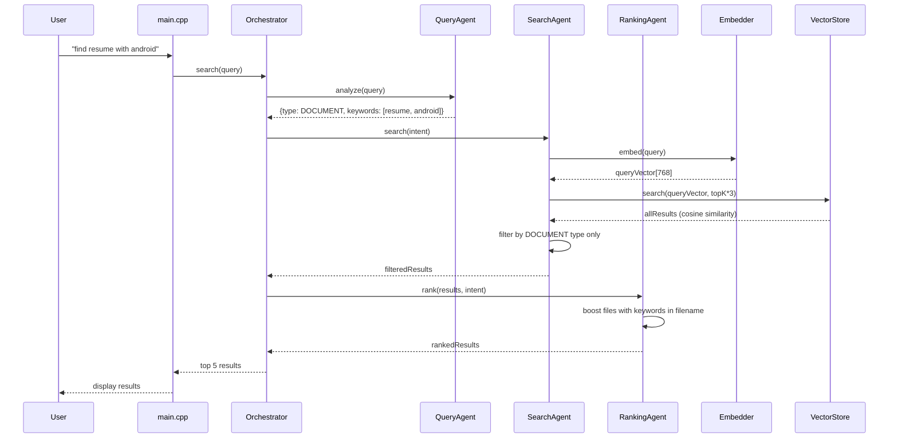

# LLM Local Search Engine

A fully native C++ semantic search engine for local files. Search your documents, PDFs, and code files using natural language — no cloud, no internet, completely private.

## What it does
Type "find resume with android experience" and it finds the right files even if the filename doesn't match — by understanding the meaning of your query.

## Architecture
```
FileScanner → TypeClassifier → ContentExtractor → Chunker → Embedder → VectorStore
                                                                            ↓
                                    QueryAgent → SearchAgent → RankingAgent → Results
```

## Tech Stack
- **Language:** C++17
- **PDF extraction:** Poppler
- **DOCX extraction:** libzip + XML parsing
- **Embeddings:** Ollama (nomic-embed-text) via libcurl — GPU accelerated
- **Vector search:** Custom cosine similarity engine
- **Build system:** CMake

## Features
- Recursively scans any local folder
- Extracts text from PDF, DOCX, TXT, MD, CSV, and code files
- Splits files into overlapping chunks for better search accuracy
- Generates 768-dimensional embeddings locally via Ollama
- Stores vectors in a custom binary vector store
- Multi-agent architecture for intelligent query understanding
- Deduplicates results by file
- Fully offline and private — no data leaves your machine

## Setup

### Prerequisites
- macOS with Ollama installed
- MacPorts: `poppler`, `libzip`
- CMake 3.10+

### Install dependencies
```bash
sudo port install poppler
sudo port install libzip
ollama pull nomic-embed-text
```

### Build
```bash
mkdir build && cd build
cmake ..
make
```

### Usage
```bash
# Index a folder
./indexer index /path/to/folder

# Search
./indexer search
🔍 Search: find resume with android experience
🔍 Search: show me python code files
🔍 Search: find documents about machine learning
```

## Project Structure
```
src/
├── indexing/
│   ├── file_scanner        — recursive file discovery
│   ├── metadata_extractor  — file size, type, modified date
│   ├── type_classifier     — categorizes files, filters junk
│   ├── content_extractor   — reads PDF, DOCX, plain text
│   └── chunker             — splits text into overlapping chunks
├── embedding/
│   └── embedder            — HTTP calls to Ollama, returns 768-dim vectors
├── storage/
│   └── vector_store        — binary vector storage, cosine similarity search
└── agents/
    ├── query_agent         — extracts intent and keywords from query
    ├── search_agent        — searches with file type filtering
    ├── ranking_agent       — boosts results by filename match
    └── orchestrator        — coordinates all agents
```

## Roadmap
- [ ] Image search using LLaVA vision model
- [ ] Full document chunking with better boundary detection  
- [ ] VS Code extension UI
- [ ] Support for more file types


## How It Works

### Indexing Sequence


### Search Sequence
